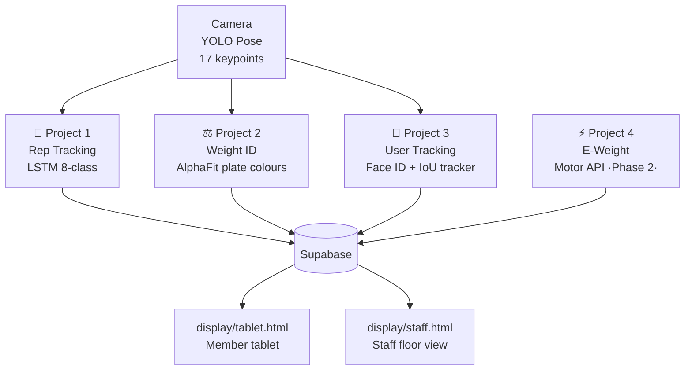

# XL Fitness AI Overseer

> One camera per machine. Every rep counted, every weight logged, every member tracked — automatically. No phones. No QR codes. No staff input.

---

## The Vision

A self-improving AI system for XL Fitness. A member sits down → the system sees them → starts a session → counts every rep → classifies form → logs to their profile. When the AI isn't sure, it flags the clip, uploads it for review, retrains, and gets smarter every week.

---

## The Four Projects



| # | Project | What it does | Status |
|---|---------|-------------|--------|
| 1 | **Rep Tracking** | Counts reps, classifies form (good/bad/half), gates rep classes until user is confirmed engaged | Live — rule-based. LSTM needs data |
| 2 | **Weight ID** | Reads AlphaFit plate stripe colours → kg value. Camera looks along barbell sleeve | Built, needs training images |
| 3 | **User Tracking** | Face ID at door assigns member name. IoU tracker follows them to the machine | Built, needs member enrolment |
| 4 | **E-Weight** | Electric brushless motor stacks on cable machines — weight read from motor API | Phase 2 — hardware pending |

---

## System Architecture

```
ENTRY PI (door camera)
  └─ InsightFace ArcFace → member identity → PersonDB

MACHINE PI (one per machine)
  ├─ YOLO Pose          → 17 keypoints / frame
  ├─ GymTracker         → track_id → member from PersonDB
  ├─ ActivityStateMachine → IDLE / ENGAGED phase gate
  ├─ LSTM Classifier    → 8-class activity (30-frame window)
  ├─ WeightDetector     → AlphaFit plate colour → kg
  ├─ WeightStackTracker → optical flow → validates rep
  ├─ ws_server.py       → WebSocket → tablet (100ms)
  ├─ set_reporter.py    → HTTP POST → Supabase / Power Automate
  └─ clip_reporter.py   → confidence < 50% → GitHub review

MAC MINI (training server)
  ├─ make sync          → rsync Pi recordings
  ├─ pose/label.html    → annotate videos
  ├─ pose/review_server → localhost:8787 review portal
  ├─ make train         → LSTM → ONNX
  └─ make deploy        → scp ONNX to Pi
```

---

## Project 1 — Rep Tracking

### 8 Activity Classes

| ID | Label | Description | Counts? |
|----|-------|-------------|---------|
| 0 | `no_person` | Nobody at machine | — |
| 1 | `user_present` | Person nearby, not seated | — |
| 2 | `on_machine` | Seated, engaged | Starts session |
| 3 | `good_rep` | Full ROM, controlled | ✅ Yes |
| 4 | `bad_rep` | Bouncing, swinging | ✅ Flagged |
| 5 | `false_rep` | Adjusting, stretching | ❌ No |
| 6 | `resting` | Seated between sets | — |
| 7 | `half_rep` | Partial ROM | ✅ Flagged |

### The Gate
- **IDLE phase** → only classes 0, 1, 2 valid
- **ENGAGED phase** → classes 2–7 valid
- Needs 10 consecutive `on_machine` frames to transition IDLE → ENGAGED
- Rep classes (3–7) are masked to `-inf` before softmax in IDLE

### Model Architecture
```
Input:  (batch, 30, 51)   30 frames × 51 features (17 keypoints × 3)
LSTM:   51 → 128 hidden
Dropout: 0.3
Linear: 128 → 64 → ReLU → 8
Output: softmax → one class wins
```

### Data Needed
- **300+ annotated segments** (≥30 per class)
- Annotate with `pose/label.html` → save to `data/annotations/`
- Train: `make train` → `models/weights/activity_v1.onnx`

### Review Loop
```
Pi uncertain (conf < 50%)
  → clip_reporter.py saves 30-frame keypoint window
  → uploads to GitHub: data/review/{machine}/{date}/
  → Mac Mini: git pull → pose/review_server.py
  → http://localhost:8787 → click correct class
  → git commit → make train → make deploy
  → Pi now smarter
```

---

## Project 2 — Weight ID (Free Weights)

### AlphaFit Plate Colours

| Stripe | Weight | Reliability |
|--------|--------|-------------|
| 🔴 Red | 25 kg | 99% |
| 🔵 Blue | 20 kg | 99% |
| 🟡 Yellow | 15 kg | 99% |
| 🟢 Green | 10 kg | 98% |
| ⚪ White | 5 kg | 95% |

### Camera Placement
- Mount on barbell frame, looking along sleeve from the side (~45°)
- **Two cameras per barbell station** — at least one always has a clear view
- Each plate appears as a coloured stripe ring in frame

### Detection Pipeline
1. YOLO finds bounding boxes around each plate stripe
2. HSV colour classification within each box → colour → kg
3. Sum all plates + 20 kg bar = total weight

### Training
```bash
# Collect 50+ photos per plate colour → data/weight_plates/images/train/
make train-weight
# → models/weights/weight_id_v1.onnx
```

> [!tip] Colour scan fallback works immediately with no training — good enough to start logging approximate weights from day one.

---

## Project 3 — User Tracking

### Flow
```
Member walks in (door camera)
  → InsightFace ArcFace (10-second IdentityWindow)
  → PersonDB.register_from_entry(member_id, name)

Member sits at machine
  → GymTracker.closest_track(machine_roi) → track_id
  → PersonDB.get_member(track_id) → name + UUID
  → db.start_session(member_id, machine_id)
```

### Components
- **`entry_camera.py`** — background thread, door-facing Pi, ArcFace recognition
- **`gym_tracker.py`** — IoU bounding box tracker per camera zone
- **`person_db.py`** — thread-safe `track_id ↔ member_id` registry

### Enrol a Member
```bash
make enrol NAME="Matthew"
# Webcam capture → 512-dim ArcFace embedding → Supabase
```

---

## Project 4 — E-Weight (Phase 2)

> [!warning] Hardware not yet built — Phase 2

- Custom brushless motor weight stacks replace traditional pin-loaded iron stacks
- Motor controller exposes local HTTP API: `GET /api/weight → {"weight_kg": 42.5}`
- Pi calls API at session start — weight is always exact (100% accurate, 1 kg increments)
- **Zero camera detection needed** — digital readout from motor controller
- Code ready: `e_weight/stack_client.py` — disabled until hardware ships

---

## Display Layer

### Member Tablet (`display/tablet.html`)
- Mounts on each machine, opens in Kiosk mode
- Connects to Pi's WebSocket server (`ws://[pi-ip]:8788`)
- Shows: **large live rep counter**, member name, weight loaded, form quality (Good/Partial/Bad)
- Auto-reconnects if Pi restarts

### Staff Floor View (`display/staff.html`)
- Open on any browser on the local network
- All machines on one screen — connect by entering each Pi's IP
- Colour-coded status: 🟢 Active set · 🟣 Resting · ⚫ Idle
- Summary bar: members in gym, machines active, machines idle

### Set Complete → Supabase
```json
{
  "machine_id":     "lat-pulldown-01",
  "member_id":      "M1089",
  "timestamp":      "2026-04-09T14:32:11Z",
  "weight_kg":      52.5,
  "reps":           10,
  "form_breakdown": { "good": 7, "partial": 2, "bad": 1 },
  "form_score":     0.78,
  "model_version":  "v1.0-lstm"
}
```

---

## Repository Structure

```
gym-ai-system/
├── pi/               ← Inference loop (runs on each machine Pi)
├── weight_id/        ← Project 2: plate colour detection
├── user_tracking/    ← Project 3: face ID + floor tracking
├── e_weight/         ← Project 4: motor stack API [Phase 2]
├── display/          ← Tablet + staff display + WebSocket server
├── face/             ← Shared: InsightFace ArcFace wrapper
├── members/          ← Shared: Supabase REST client
├── train/            ← Project 1 training (Mac Mini)
├── pose/             ← Annotation + review portal
├── data/
│   ├── annotations/  ← Activity labels — COMMIT
│   ├── review/       ← Pi-flagged clips — COMMIT after reviewing
│   ├── weight_plates/← Plate training images — NOT in git
│   └── members/      ← Face photos — NOT in git
├── models/
│   ├── registry.json ← Model version log
│   └── weights/      ← .onnx files — NOT in git
├── configs/
│   ├── lat_pulldown.json
│   ├── machine_template.json
│   └── weight_plate_colours.json
└── Makefile
```

---

## Hardware Per Machine

| Part | Purpose | Cost |
|------|---------|------|
| Raspberry Pi 5 (4GB) | Edge inference | £80 |
| Hailo-8 AI HAT+ (26 TOPS) | NPU — YOLO at 30fps | £70 |
| Pi Camera Module 3 Wide | Side-on machine view | £35 |
| PoE+ HAT | Single cable: power + network | £25 |
| Mount + housing | Bracket | £20 |
| **Total per machine** | | **£230** |

Additional per barbell station: 2× Pi Camera Module 3 (£35 each) for weight ID.  
Entry camera Pi: 1× Raspberry Pi 5 + camera (~£115).  
Shared: Mac Mini M4 (~£700) trains all models.

---

## Make Commands

```bash
# Rep Tracking
make sync PI=pi@IP      # pull Pi recordings
make train              # train LSTM + export ONNX
make deploy PI=pi@IP    # push to Pi + restart service
make review             # review portal at localhost:8787
make stats              # annotation counts per class
make pending            # Pi clips needing review
make annotate           # open annotation tool

# Weight ID
make train-weight       # train YOLO plate detector
make test-weight        # quick colour scan test

# User Tracking
make enrol NAME="..."   # enrol a member face
make entry-camera       # run entry camera standalone

# Ops
make logs PI=pi@IP      # tail Pi logs live
make ssh  PI=pi@IP      # SSH into Pi
```

---

## Current Blockers (Data Collection Phase)

> [!important] The code is built. These are the real-world steps needed before going live.

- [ ] **Collect 300+ annotated rep segments** (all 8 classes, ≥30 each) → `make train`
- [ ] **Collect 50+ weight plate photos per colour** → `make train-weight`
- [ ] **Enrol all members** → `make enrol NAME="..."`
- [ ] **Set Supabase credentials** in `pi/config.py`
- [ ] **Deploy models to Pi** → `make deploy PI=pi@IP`
- [ ] **Test end-to-end**: person sits → rep counted → session logged

---

## Links

- **GitHub (private):** https://github.com/Matt-xlfitness/Gym-Overseer-AI
- **GitHub (dev):** https://github.com/XLDonkey/gym-ai-system
- **Bible (live):** https://xldonkey.github.io/gym-ai-system/bible.html
- **Supabase:** https://supabase.com (project dashboard)
