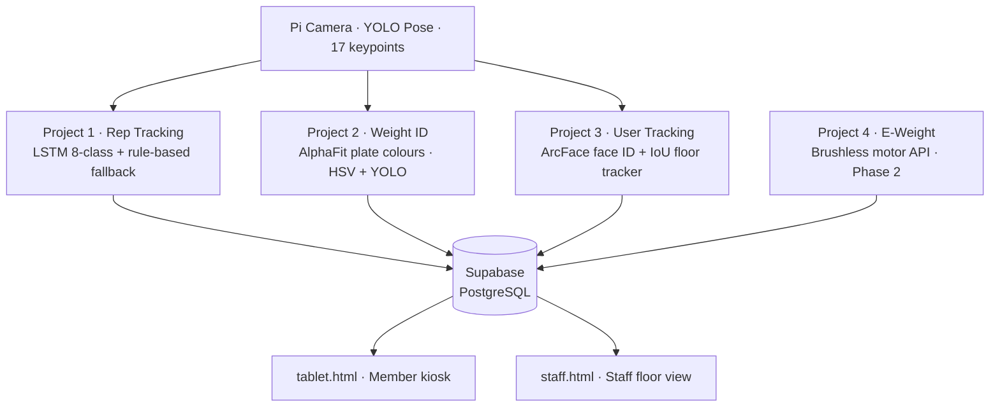

# XL Fitness AI Overseer

> One camera per machine. Every rep counted, every weight logged, every member tracked — automatically. No phones. No QR codes. No staff input.

This is the **Map of Content (MOC)** — start here, follow the links.

---

## The Four Projects

| # | Project | Status | Key file |
|---|---------|--------|----------|
| 1 | [[Projects/Rep Tracking]] | **Live — rule-based. LSTM needs data** | `pi/activity_state_machine.py` |
| 2 | [[Projects/Weight ID]] | Built — needs 50+ training images per colour | `weight_id/detector.py` |
| 3 | [[Projects/User Tracking]] | Built — needs member enrolment | `user_tracking/gym_tracker.py` |
| 4 | [[Projects/E-Weight]] | Phase 2 — hardware not yet built | `e_weight/stack_client.py` |

---

## System Notes

- [[System/Architecture]] — full data flow and component map
- [[System/Activity Classes]] — the 8-class schema with thresholds
- [[System/LSTM Model]] — model spec, training, ONNX deployment
- [[System/YOLO Pipeline]] — keypoint extraction, Hailo vs CPU
- [[System/Engagement Detector]] — zone + pose gate, prevents phantom sessions
- [[System/WebSocket Layer]] — live tablet + staff display
- [[System/Review Loop]] — how the Pi gets smarter over time
- [[System/Session Recorder]] — video capture + Google Drive upload
- [[System/Database Schema]] — Supabase tables and views

---

## Hardware

- [[Hardware/Machine Pi]] — Pi 5 + Hailo HAT per machine
- [[Hardware/Camera Placement]] — mounting angles, ROI calibration
- [[Hardware/Costs]] — full BOM, 10-machine gym example

---

## Data

- [[Data/AlphaFit Plates]] — colour stripe → kg mapping + HSV ranges
- [[Data/Training Requirements]] — what must be collected before go-live

---

## Decisions

- [[Decisions/Stack Choices]] — why Supabase, ONNX, IoU tracker, etc.
- [[Decisions/Display Layer]] — tablet vs Power Apps vs Next.js

---

## People & Access

- [[People/Repos and Access]] — GitHub repos, branches, PAT auth

---

## Current Blockers

- [ ] Collect 300+ annotated rep segments → `make train`
- [ ] Collect 50+ weight plate photos per colour → `make train-weight`
- [ ] Enrol all members → `make enrol NAME="..."`
- [ ] Set `SUPABASE_URL` + `SUPABASE_SERVICE_KEY` in `pi/config.py`
- [ ] Deploy ONNX model to Pi → `make deploy PI=pi@IP`
- [ ] Test end-to-end: person sits → rep counted → session logged

---

## Key Numbers

| Constant | Value | Meaning |
|----------|-------|---------|
| ANGLE_TOP | 130° | Arms extended — rep top |
| ANGLE_BOTTOM | 90° | Bar pulled down — rep bottom |
| MIN_ROM_DEGREES | 40° | Minimum range of motion to count |
| ENGAGE_FRAMES | 10 | Frames of `on_machine` to start session |
| DISENGAGE_FRAMES | 45 | Frames of idle to end session |
| FACE_THRESHOLD | 0.40 | Cosine similarity for face match |
| ONNX_REVIEW_THRESH | 0.50 | Below this → clip flagged to GitHub |
| LSTM_WINDOW | 30 frames | 1 second at 30fps |
