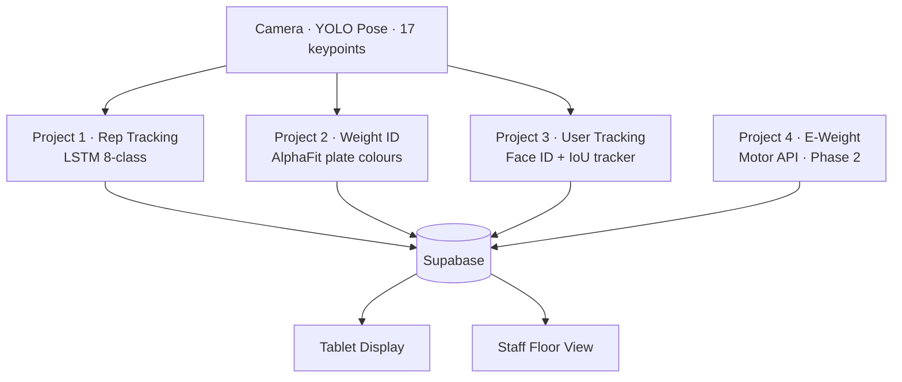

# XL Fitness AI Overseer

> One camera per machine. Every rep counted, every weight logged, every member tracked — automatically.

This is the **Map of Content** (MOC) for the entire Overseer project. Start here.

---

## The Four Projects

| Project | Note | Status |
|---------|------|--------|
| Rep Tracking | [[Projects/Rep Tracking]] | Live (rule-based) — LSTM needs data |
| Weight ID | [[Projects/Weight ID]] | Built — needs training images |
| User Tracking | [[Projects/User Tracking]] | Built — needs member enrolment |
| E-Weight | [[Projects/E-Weight]] | Phase 2 — hardware pending |

---

## System

- [[System/Architecture]] — full system diagram
- [[System/Activity Classes]] — the 8-class schema
- [[System/LSTM Model]] — model spec, training, deployment
- [[System/YOLO Pipeline]] — keypoint extraction
- [[System/WebSocket Layer]] — tablet + staff display
- [[System/Review Loop]] — how the Pi gets smarter
- [[System/Database Schema]] — Supabase tables

---

## Hardware

- [[Hardware/Machine Pi]] — Pi 5 + Hailo HAT per machine
- [[Hardware/Camera Placement]] — mounting angles
- [[Hardware/Costs]] — full hardware BOM

---

## Data

- [[Data/AlphaFit Plates]] — colour → kg mapping
- [[Data/Training Requirements]] — what data is needed before go-live

---

## Decisions

- [[Decisions/Stack Choices]] — why Supabase, ONNX, IoU tracker etc.
- [[Decisions/Display Layer]] — tablet vs staff vs Power Apps vs Next.js

---

## People & Repos

- [[People/Repos and Access]] — GitHub repos, who has access

---

## Current Blockers

- [ ] 300+ annotated rep segments → `make train`
- [ ] 50+ weight plate photos per colour → `make train-weight`
- [ ] Enrol all members → `make enrol NAME="..."`
- [ ] Set Supabase credentials in `pi/config.py`
- [ ] Deploy models to Pi → `make deploy PI=pi@IP`
- [ ] Test end-to-end: person sits → rep counted → session logged
